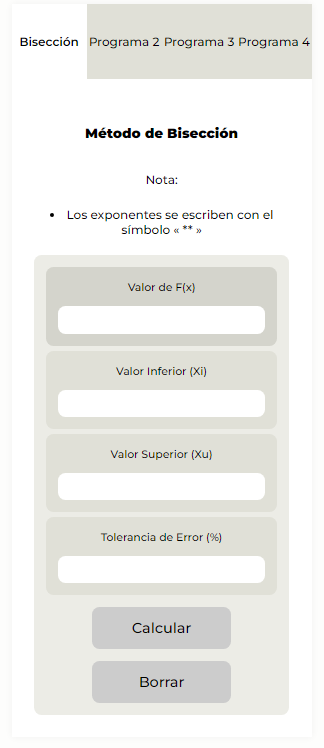
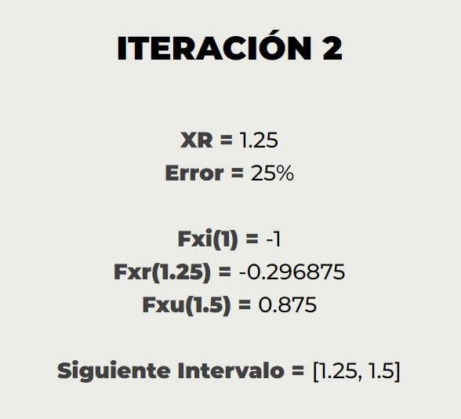
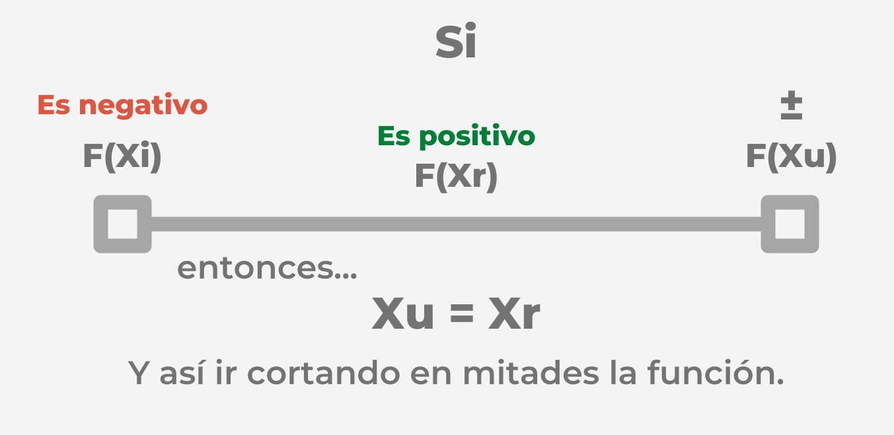
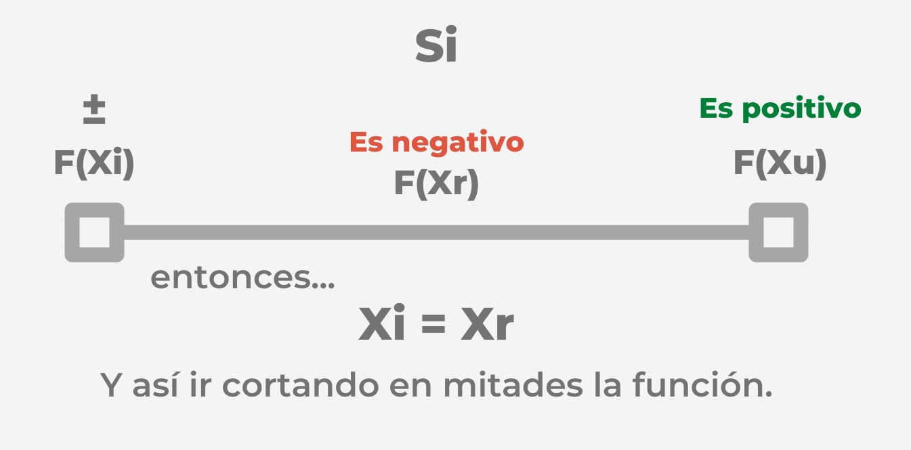

<div align="center">
  <h1>
    🌐 Calculadora de M&eacute;todos de Aproximaci&oacute;n de Ra&iacute;ces
  </h1>
  <!-- BISECCIÓN -->
  <h2>➡️ M&eacute;todo de Bisecci&oacute;n</h2>
  <br />
  <!-- IMAGEN-BISECCIÓN -->
  <br /><br />
</div>
<h3>↪️ Funcionamientos de biseccion()</h3>

  <p>Dentro de main.js (src/main.js), la funci&oacute;n biseccion() &uacute;nicamente realiza el c&aacute;lculo del m&eacute;todo de bisecci&oacute;n.

En el primer bloque, se declaran todas las variables [Fx, Xi, Xu, Tolerancia de Error y Result (o bloque oculto)], exportandolas desde index.html:

```javascript
let fx = document.getElementById("Fx").value; // FUNCTION
let xi = parseFloat(document.getElementById("Xi").value); //X INFERIOR
let xu = parseFloat(document.getElementById("Xu").value); //X SUPERIOR
let toleranciaError = parseFloat(
  document.getElementById("ToleranciaError").value
); //TOLERANCIA DE ERROR PER ITERACION
let result = document.getElementById("Result"); //ITERACION IMPRESA
result.innerHTML = "";
```

En el siguiente bloque se inicializan dos variables antes de empezar el bucle (de las iteraciones):

```javascript
let porcentualError = 0;
let iteracion = 0;
```

En el siguiente bloque se inicializa el ciclo _do...while_, ejecutando en bucle cierto c&oacute;digo hasta que la condici&oacute;n establecida sea falsa:

```javascript
do {
  sentencia
} while (condición);
```

```javascript
do {
    iteracion++;
    porcentualError = Math.abs(((xu - xi) / 2) * 100);
    let xr = (xi + xu) / 2;

    //EVALUAR F(xi) F(xr) F(xu);
    let fXI = eval(fx.replace(/x/g, xi));
    let fXR = eval(fx.replace(/x/g, xr));
    let fXU = eval(fx.replace(/x/g, xu));

    //EVALUAR NUEVO INTERVALO PARA IMPRIMIRLO
    let nuevoIntervalo = 0;
    if (Math.sign(fXI) === -1 && Math.sign(fXR) === 1) {
      nuevoIntervalo = `[${xi}, ${xr}]`;
    }
    if (Math.sign(fXR) === -1 && Math.sign(fXU) === 1) {
      nuevoIntervalo = `[${xr}, ${xu}]`;
    }

    result.innerHTML += `<h2>ITERACIÓN ${iteracion}</h2><p><b>XR = </b>${xr}<br><b>Error = </b>${porcentualError}%<br><br><b>Fxi(${xi}) = </b>${fXI}<br><b>Fxr(${xr}) = </b>${fXR}<br><b>Fxu(${xu}) = </b>${fXU}<br><br><b>Siguiente Intervalo = </b>${nuevoIntervalo}</p>`;

    //ASIGNAR Xu y Xi
    if (Math.sign(fXI) === -1 && Math.sign(fXR) === 1) {
      xu = xr;
    }
    if (Math.sign(fXR) === -1 && Math.sign(fXU) === 1) {
      xi = xr;
    }
  } while (porcentualError >= toleranciaError);
```

En el primer bloque _do_, se asigna el incremento _iteracion++_ (esta imprime en Result el n&uacute;mero de la iteraci&oacute;n «ITERACI&Oacute;N 8..9..10..»); Se asigna el valor del error porcentual; Y se declara el valor de Xr:

```javascript
    iteracion++;
    porcentualError = Math.abs(((xu - xi) / 2) * 100);
    let xr = (xi + xu) / 2;
```

Se eval&uacute;a Xi, Xr, Xu, con la f&oacute;rmula establecida en F(x), esto para conocer los valores de F(xi), F(xr), F(xu) y as&iacute; conocer el siguiente intervalo:

```javascript
//EVALUAR F(xi) F(xr) F(xu);
    let fXI = eval(fx.replace(/x/g, xi));
    let fXR = eval(fx.replace(/x/g, xr));
    let fXU = eval(fx.replace(/x/g, xu));
```

(&Uacute;nicamente para imprimirlo en pantalla) Se eval&uacute;a el nuevo intervalo. Se declara _nuevoIntervalo_ en 0, si F(xi) es negativo y F(xr) es positivo el intervalo es [Xi, Xr], pero, si F(xr) es negativo y F(xu) es positivo el intervalo es [Xr, Xu]:

```javascript
//EVALUAR NUEVO INTERVALO PARA IMPRIMIRLO
    let nuevoIntervalo = 0;
    if (Math.sign(fXI) === -1 && Math.sign(fXR) === 1) {
      nuevoIntervalo = `[${xi}, ${xr}]`;
    }
    if (Math.sign(fXR) === -1 && Math.sign(fXU) === 1) {
      nuevoIntervalo = `[${xr}, ${xu}]`;
    }
```

Se asigna en adici&oacute;n mediante JavaScript los valores calculados de _iteracion, xr, porcentualError, fXI, fXR, fXU, nuevoIntervalo_ en formato HTML:

```javascript
result.innerHTML += `<h2>ITERACIÓN ${iteracion}</h2><p><b>XR = </b>${xr}<br><b>Error = </b>${porcentualError}%<br><br><b>Fxi(${xi}) = </b>${fXI}<br><b>Fxr(${xr}) = </b>${fXR}<br><b>Fxu(${xu}) = </b>${fXU}<br><br><b>Siguiente Intervalo = </b>${nuevoIntervalo}</p>`;
```
As&iacute; es como luce:
<div align="center">

</div>

En el &uacute;ltimo bloque del ciclo, se asigna otra vez el valor de Xu y Xi, para considerarlos en la siguiente iteraci&oacute;n. Mediante la siguiente condici&oacute;n:

```javascript
//ASIGNAR Xu y Xi
    if (Math.sign(fXI) === -1 && Math.sign(fXR) === 1) {
      xu = xr;
    }
    if (Math.sign(fXR) === -1 && Math.sign(fXU) === 1) {
      xi = xr;
    }
```

Esta condici&oacute;n quiere decir:

<div align="center">
<br><br>

</div>

Como condici&oacute;n del bucle en _while_, el c&oacute;digo se va a ciclar mientras el error porcentual sea mayor o igual que la tolerancia de error porcentual establecida (cuando esto sea _false_ entonces se terminan las iteraciones).:

```javascript
while (porcentualError >= toleranciaError);
```

</p>